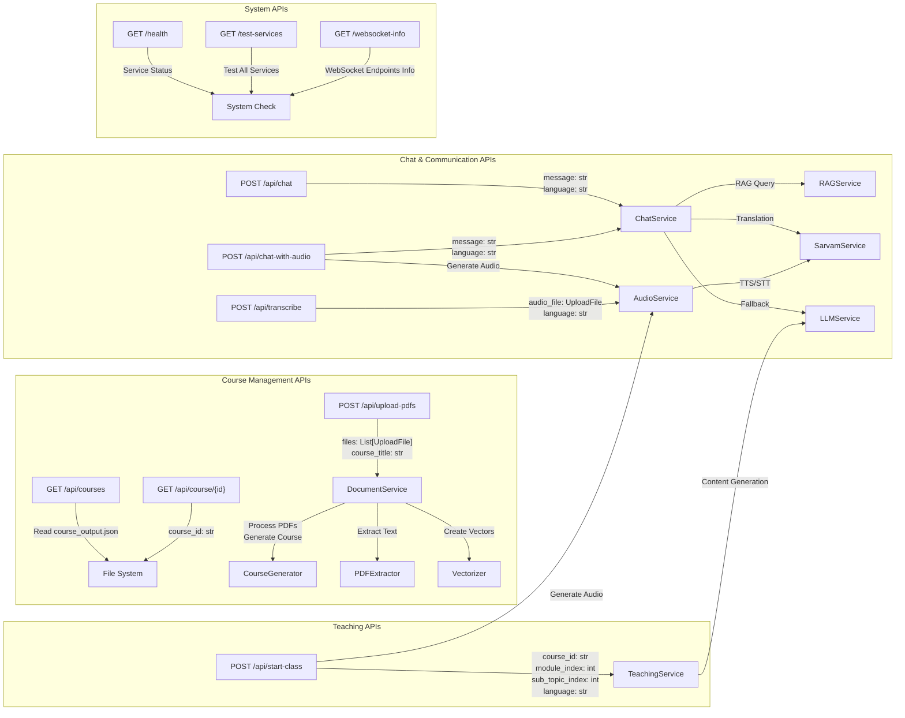
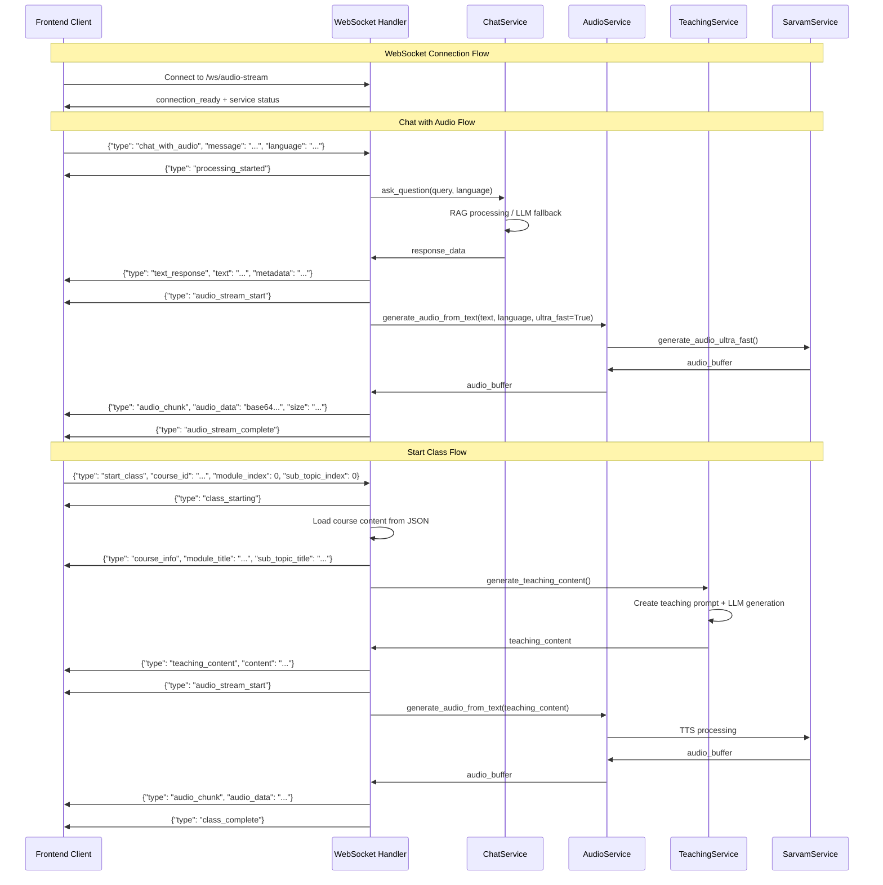
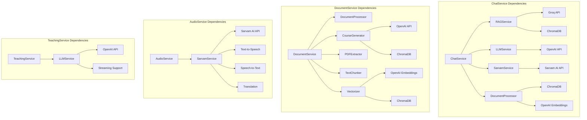
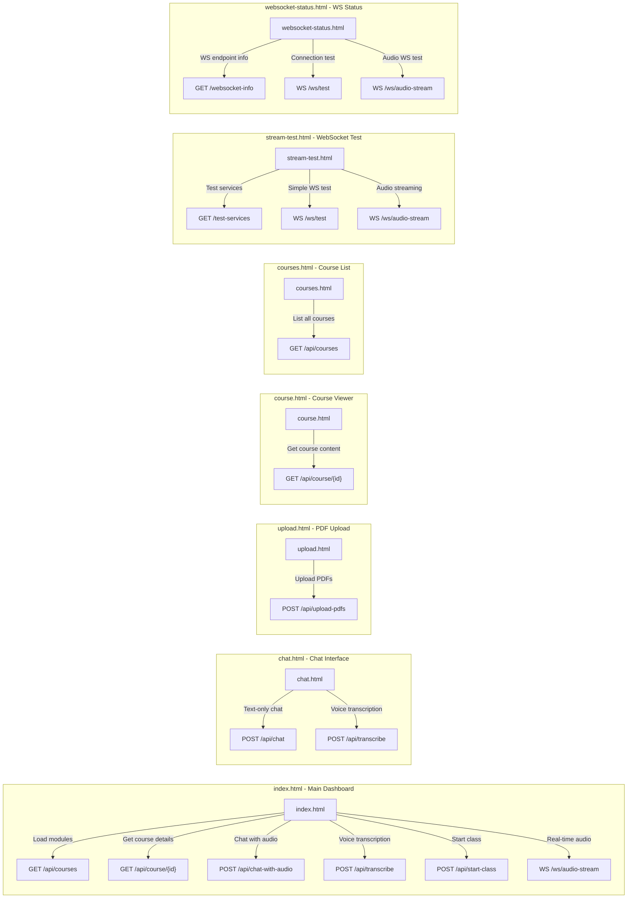
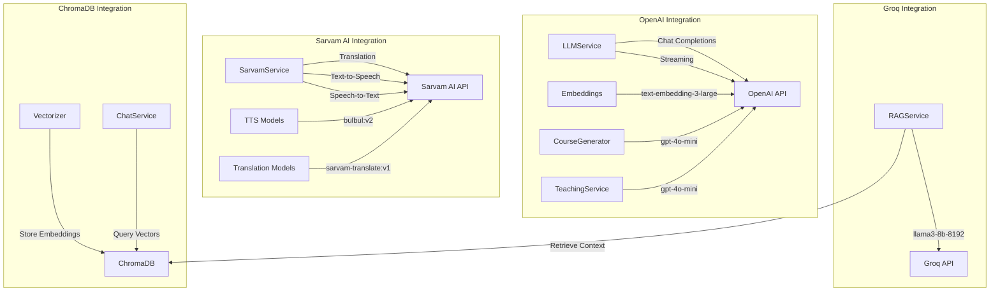
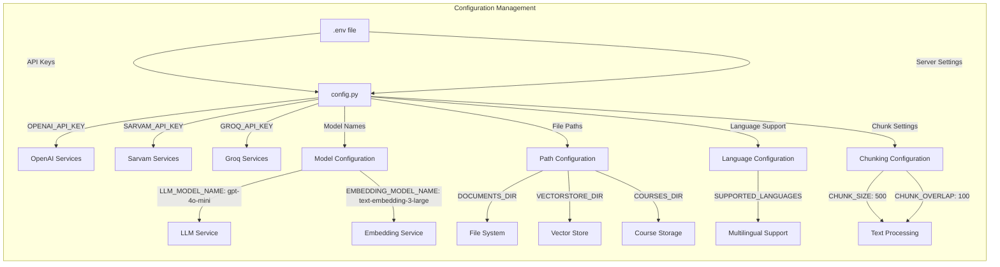

# ProfAI Architecture Diagrams

This document contains comprehensive Mermaid diagrams showing the complete architecture of the ProfAI system, including API endpoints, service connections, and frontend integrations.

## 1. Overall System Architecture

```mermaid
graph TB
    subgraph "Frontend Layer"
        UI1[index.html<br/>Main Dashboard]
        UI2[chat.html<br/>Chat Interface]
        UI3[upload.html<br/>PDF Upload]
        UI4[course.html<br/>Course Viewer]
        UI5[courses.html<br/>Course List]
        UI6[stream-test.html<br/>WebSocket Test]
        UI7[websocket-status.html<br/>WS Status]
    end
    
    subgraph "API Layer - FastAPI"
        API[app.py<br/>Main FastAPI App]
        
        subgraph "REST Endpoints"
            REST1["/api/upload-pdfs"]
            REST2["/api/courses"]
            REST3["/api/course/{id}"]
            REST4["/api/chat"]
            REST5["/api/chat-with-audio"]
            REST6["/api/transcribe"]
            REST7["/api/start-class"]
            REST8["/health"]
            REST9["/test-services"]
            REST10["/websocket-info"]
        end
        
        subgraph "WebSocket Endpoints"
            WS1["/ws/test"]
            WS2["/ws/audio-stream"]
        end
        
        subgraph "Static Routes"
            STATIC["/static files"]
            ROUTES["HTML routes"]
        end
    end
    
    subgraph "Service Layer"
        CHAT[ChatService]
        DOC[DocumentService]
        AUDIO[AudioService]
        TEACH[TeachingService]
        LLM[LLMService]
        RAG[RAGService]
        SARVAM[SarvamService]
    end
    
    subgraph "Core Layer"
        COURSE[CourseGenerator]
        VECTOR[Vectorizer]
    end
    
    subgraph "Processor Layer"
        PDF[PDFExtractor]
        CHUNK[TextChunker]
    end
    
    subgraph "External APIs"
        OPENAI[OpenAI API]
        SARVAM_API[Sarvam AI API]
        GROQ[Groq API]
    end
    
    subgraph "Data Storage"
        CHROMA[ChromaDB<br/>Vector Store]
        FILES[File System<br/>PDFs & JSON]
    end
    
    %% Frontend to API connections
    UI1 --> REST2
    UI1 --> REST3
    UI1 --> REST5
    UI1 --> REST6
    UI1 --> REST7
    UI1 --> WS2
    
    UI2 --> REST4
    UI2 --> REST6
    
    UI3 --> REST1
    
    UI4 --> REST3
    
    UI5 --> REST2
    
    UI6 --> WS1
    UI6 --> WS2
    UI6 --> REST9
    
    UI7 --> REST10
    UI7 --> WS1
    UI7 --> WS2
    
    %% API to Service connections
    API --> CHAT
    API --> DOC
    API --> AUDIO
    API --> TEACH
    
    %% Service interconnections
    CHAT --> LLM
    CHAT --> RAG
    CHAT --> SARVAM
    CHAT --> DOC
    
    DOC --> COURSE
    DOC --> VECTOR
    DOC --> PDF
    DOC --> CHUNK
    
    AUDIO --> SARVAM
    
    TEACH --> LLM
    
    RAG --> GROQ
    
    LLM --> OPENAI
    
    SARVAM --> SARVAM_API
    
    %% Data connections
    VECTOR --> CHROMA
    RAG --> CHROMA
    DOC --> FILES
    COURSE --> FILES
```

## 2. API Endpoint Details

## 3. WebSocket Architecture

## 4. Service Layer Architecture

## 5. Frontend to API Mapping

## 6. Data Flow Architecture

```mermaid
flowchart TD
    subgraph "PDF Processing Flow"
        PDF1[PDF Upload] --> EXTRACT[Text Extraction]
        EXTRACT --> CHUNK[Text Chunking]
        CHUNK --> EMBED[Embedding Generation]
        EMBED --> VECTOR[Vector Storage]
        VECTOR --> COURSE_GEN[Course Generation]
        COURSE_GEN --> JSON[JSON Storage]
    end
    
    subgraph "Chat Flow"
        QUERY[User Query] --> TRANSLATE[Translation if needed]
        TRANSLATE --> RAG[RAG Retrieval]
        RAG --> VECTOR_DB[Vector Database]
        VECTOR_DB --> CONTEXT[Context Retrieval]
        CONTEXT --> LLM_PROC[LLM Processing]
        LLM_PROC --> RESPONSE[Text Response]
        RESPONSE --> TTS[Text-to-Speech]
        TTS --> AUDIO_OUT[Audio Output]
    end
    
    subgraph "Teaching Flow"
        CLASS_REQ[Class Request] --> LOAD_CONTENT[Load Course Content]
        LOAD_CONTENT --> JSON_READ[Read JSON File]
        JSON_READ --> TEACHING_PROMPT[Generate Teaching Prompt]
        TEACHING_PROMPT --> LLM_TEACH[LLM Teaching Generation]
        LLM_TEACH --> TEACHING_CONTENT[Teaching Content]
        TEACHING_CONTENT --> TTS_TEACH[Text-to-Speech]
        TTS_TEACH --> CLASS_AUDIO[Class Audio]
    end
    
    subgraph "WebSocket Flow"
        WS_CONNECT[WebSocket Connection] --> MSG_RECEIVE[Receive Message]
        MSG_RECEIVE --> MSG_ROUTE[Route by Type]
        MSG_ROUTE --> CHAT_HANDLER[Chat Handler]
        MSG_ROUTE --> CLASS_HANDLER[Class Handler]
        MSG_ROUTE --> AUDIO_HANDLER[Audio Handler]
        
        CHAT_HANDLER --> STREAM_TEXT[Stream Text Response]
        CHAT_HANDLER --> STREAM_AUDIO[Stream Audio Response]
        
        CLASS_HANDLER --> STREAM_CONTENT[Stream Teaching Content]
        CLASS_HANDLER --> STREAM_CLASS_AUDIO[Stream Class Audio]
        
        AUDIO_HANDLER --> STREAM_TTS[Stream TTS Audio]
    end
```

## 7. External API Integration

## 8. Configuration and Settings

## 9. Error Handling and Logging

```mermaid
graph TB
    subgraph "Error Handling Flow"
        REQUEST[API Request] --> VALIDATION[Input Validation]
        VALIDATION --> |"Valid"| PROCESSING[Service Processing]
        VALIDATION --> |"Invalid"| ERROR1[HTTP 400 Error]
        
        PROCESSING --> |"Success"| RESPONSE[Success Response]
        PROCESSING --> |"Service Error"| ERROR2[HTTP 500 Error]
        PROCESSING --> |"Service Unavailable"| ERROR3[HTTP 503 Error]
        
        ERROR1 --> LOG1[Error Logging]
        ERROR2 --> LOG2[Error Logging]
        ERROR3 --> LOG3[Error Logging]
        
        LOG1 --> CLIENT_ERROR[Client Error Response]
        LOG2 --> SERVER_ERROR[Server Error Response]
        LOG3 --> SERVICE_ERROR[Service Error Response]
    end
    
    subgraph "WebSocket Error Handling"
        WS_MSG[WebSocket Message] --> WS_VALIDATION[Message Validation]
        WS_VALIDATION --> |"Valid"| WS_PROCESSING[Message Processing]
        WS_VALIDATION --> |"Invalid"| WS_ERROR1[Error Message]
        
        WS_PROCESSING --> |"Success"| WS_RESPONSE[Success Response]
        WS_PROCESSING --> |"Error"| WS_ERROR2[Error Message]
        
        WS_ERROR1 --> WS_LOG[WebSocket Logging]
        WS_ERROR2 --> WS_LOG
        
        WS_LOG --> WS_CLIENT[Client Error Notification]
    end
    
    subgraph "Service Health Monitoring"
        HEALTH_CHECK[Health Check] --> SERVICE_STATUS[Check Service Status]
        SERVICE_STATUS --> |"All OK"| HEALTHY[Healthy Response]
        SERVICE_STATUS --> |"Issues"| UNHEALTHY[Unhealthy Response]
        
        UNHEALTHY --> ALERT[Service Alert]
        ALERT --> RECOVERY[Recovery Actions]
    end
```

## Summary

This architecture documentation provides a comprehensive view of the ProfAI system:

1. **Overall System Architecture**: Shows the complete system with all layers and connections
2. **API Endpoint Details**: Detailed view of all REST endpoints and their service connections
3. **WebSocket Architecture**: Real-time communication flow and message handling
4. **Service Layer Architecture**: Internal service dependencies and connections
5. **Frontend to API Mapping**: How each frontend component connects to backend APIs
6. **Data Flow Architecture**: How data moves through the system for different operations
7. **External API Integration**: Third-party service integrations (OpenAI, Sarvam AI, Groq)
8. **Configuration Management**: How settings and configurations are managed
9. **Error Handling and Logging**: Error handling patterns and logging strategies

The system follows a clean layered architecture with clear separation of concerns:
- **Frontend Layer**: Multiple HTML interfaces for different use cases
- **API Layer**: FastAPI with both REST and WebSocket endpoints
- **Service Layer**: Business logic services with specific responsibilities
- **Core Layer**: Course generation and vectorization logic
- **Processor Layer**: Document and text processing utilities
- **External APIs**: Third-party AI service integrations
- **Data Storage**: Vector database and file system storage

This architecture supports both traditional request-response patterns and real-time streaming for optimal user experience.