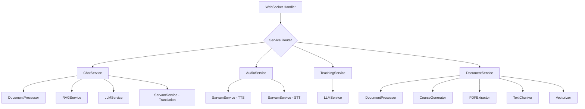
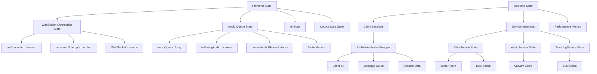
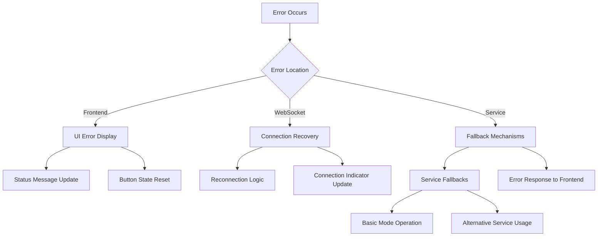

# ProfAI System Flow Chart

## Complete Function Mapping and Call Flow

### 1. Frontend (web/index.html) → WebSocket → Backend Services

```mermaid
graph TD
    %% Frontend Components
    A[Frontend - index.html] --> B[WebSocket Connection]
    A --> C[User Actions]
    
    %% User Actions
    C --> D[Send Text Message]
    C --> E[Voice Recording]
    C --> F[Start Class]
    C --> G[Load Course Modules]
    
    %% WebSocket Connection Flow
    B --> H[initWebSocket()]
    H --> I[WebSocket Server - websocket_server.py]
    I --> J[websocket_handler()]
    J --> K[ProfAIWebSocketWrapper]
    K --> L[ProfAIAgent]
    
    %% Message Routing
    L --> M[process_messages()]
    M --> N{Message Type}
    
    %% Chat Flow
    N -->|chat_with_audio| O[handle_chat_with_audio()]
    O --> P[ChatService.ask_question()]
    P --> Q[RAGService.get_answer()]
    P --> R[LLMService.generate_response()]
    O --> S[AudioService.stream_audio_from_text()]
    S --> T[SarvamService.stream_audio_generation()]
    T --> U[Real-time Audio Chunks]
    U --> V[Frontend Audio Queue]
    
    %% Class Flow
    N -->|start_class| W[handle_start_class()]
    W --> X[TeachingService.generate_teaching_content()]
    X --> Y[LLMService.generate_response()]
    W --> Z[AudioService.stream_audio_from_text()]
    
    %% Voice Flow
    N -->|transcribe_audio| AA[handle_transcribe_audio()]
    AA --> BB[AudioService.transcribe_audio()]
    BB --> CC[SarvamService.transcribe_audio()]
    
    %% Audio Only Flow
    N -->|audio_only| DD[handle_audio_only()]
    DD --> EE[AudioService.stream_audio_from_text()]
```

### 2. Detailed Service Layer Flow



### 3. Frontend Function Call Map

```mermaid
graph TD
    %% Frontend Initialization
    A[Page Load] --> B[init()]
    B --> C[populateLanguages()]
    B --> D[loadCourseModules()]
    B --> E[setupClassControls()]
    B --> F[initWebSocket()]
    
    %% WebSocket Functions
    F --> G[WebSocket Event Handlers]
    G --> H[handleWebSocketMessage()]
    H --> I[handleAudioChunk()]
    H --> J[handleAudioComplete()]
    H --> K[displayTeachingContent()]
    
    %% Audio Management
    I --> L[queueAudioChunk()]
    L --> M[playNextAudioChunk()]
    M --> N[Audio Element Creation]
    
    %% User Interactions
    O[User Input] --> P{Action Type}
    P -->|Text| Q[handleSendText()]
    P -->|Voice| R[Voice Recording Flow]
    P -->|Class| S[startClass()]
    
    %% Text Chat Flow
    Q --> T[WebSocket Send]
    T --> U[chat_with_audio message]
    
    %% Voice Flow
    R --> V[MediaRecorder]
    V --> W[handleVoiceStop()]
    W --> X[Base64 Conversion]
    X --> Y[WebSocket Send]
    Y --> Z[transcribe_audio message]
    
    %% Class Flow
    S --> AA[Module/Topic Selection]
    AA --> BB[WebSocket Send]
    BB --> CC[start_class message]
```

### 4. Backend WebSocket Message Flow

```mermaid
graph TD
    %% WebSocket Server Entry
    A[WebSocket Connection] --> B[websocket_handler()]
    B --> C[ProfAIWebSocketWrapper Creation]
    C --> D[ProfAIAgent Creation]
    D --> E[Service Initialization]
    
    %% Service Initialization
    E --> F[ChatService Init]
    E --> G[AudioService Init]
    E --> H[TeachingService Init]
    
    %% Message Processing Loop
    D --> I[process_messages() Loop]
    I --> J[Message Reception]
    J --> K{Message Type Router}
    
    %% Chat Message Flow
    K -->|chat_with_audio| L[handle_chat_with_audio()]
    L --> M[Input Validation]
    M --> N[Send Acknowledgment]
    N --> O[ChatService.ask_question()]
    O --> P[Text Response Send]
    P --> Q[Audio Generation Start]
    Q --> R[AudioService.stream_audio_from_text()]
    R --> S[Chunk-by-Chunk Streaming]
    S --> T[Audio Complete Signal]
    
    %% Class Message Flow
    K -->|start_class| U[handle_start_class()]
    U --> V[Course Content Loading]
    V --> W[TeachingService.generate_teaching_content()]
    W --> X[Content Response Send]
    X --> Y[Audio Generation for Class]
    
    %% Voice Message Flow
    K -->|transcribe_audio| Z[handle_transcribe_audio()]
    Z --> AA[Base64 Decode]
    AA --> BB[AudioService.transcribe_audio()]
    BB --> CC[Transcription Response Send]
```

### 5. Service Layer Detailed Flow

```mermaid
graph TD
    %% ChatService Internal Flow
    A[ChatService.ask_question()] --> B{RAG Available?}
    B -->|Yes| C[Query Translation]
    C --> D[RAGService.get_answer()]
    D --> E[Vector Store Query]
    E --> F[LLM Processing]
    F --> G[Response Translation]
    B -->|No| H[LLMService.get_general_response()]
    
    %% AudioService Internal Flow
    I[AudioService.stream_audio_from_text()] --> J[SarvamService.stream_audio_generation()]
    J --> K[Text Cleaning]
    K --> L[Chunk Processing]
    L --> M{Streaming Type}
    M -->|Direct| N[_stream_audio_direct()]
    M -->|Immediate| O[_stream_audio_immediate()]
    N --> P[Sarvam WebSocket Connection]
    O --> Q[Parallel Chunk Processing]
    
    %% TeachingService Internal Flow
    R[TeachingService.generate_teaching_content()] --> S[Teaching Prompt Creation]
    S --> T[LLMService.generate_response()]
    T --> U[Content Formatting for TTS]
    
    %% SarvamService Internal Flow
    V[SarvamService Operations] --> W{Operation Type}
    W -->|TTS| X[Text-to-Speech Processing]
    W -->|STT| Y[Speech-to-Text Processing]
    W -->|Translation| Z[Text Translation]
    X --> AA[Streaming Audio Generation]
    Y --> BB[Audio Transcription]
    Z --> CC[Language Translation]
```

### 6. Data Flow and State Management



## Key Function Mappings

### Frontend → WebSocket Messages

| Frontend Function | WebSocket Message Type | Backend Handler |
|------------------|----------------------|-----------------|
| `handleSendText()` | `chat_with_audio` | `handle_chat_with_audio()` |
| `handleVoiceStop()` | `transcribe_audio` | `handle_transcribe_audio()` |
| `startClass()` | `start_class` | `handle_start_class()` |
| `testPing()` | `ping` | `handle_ping()` |

### Backend Services → Frontend Responses

| Backend Service | Response Type | Frontend Handler |
|----------------|---------------|------------------|
| `ChatService` | `text_response` | `handleWebSocketMessage()` |
| `AudioService` | `audio_chunk` | `handleAudioChunk()` |
| `TeachingService` | `teaching_content` | `displayTeachingContent()` |
| `SarvamService` | `transcription_complete` | Message routing |

### Critical Performance Paths

1. **Sub-300ms Audio Streaming Path:**
   ```
   Frontend → WebSocket → handle_chat_with_audio() → 
   AudioService → SarvamService → _stream_audio_direct() → 
   Real-time chunks → Frontend audio queue → Sequential playback
   ```

2. **Voice-to-Text-to-Speech Path:**
   ```
   Voice Recording → Base64 → transcribe_audio → 
   SarvamService STT → Transcription → Auto-send → 
   Chat flow → Audio streaming
   ```

3. **Class Teaching Path:**
   ```
   Module Selection → start_class → Course loading → 
   TeachingService → Content generation → Audio streaming → 
   Sequential playback
   ```

## Error Handling Flow



This comprehensive flow chart shows how every function connects from the frontend user interactions all the way through the WebSocket layer to the backend services and back to the user interface.