# Index.html API Integration & Data Flow

This document provides a detailed view of how the main dashboard (index.html) integrates with various APIs and services, showing the bidirectional flow of data between UI components and backend services.

## 1. UI Components to API Mapping

```mermaid
graph LR
    subgraph "Frontend UI Components"
        direction TB
        
        subgraph "Left Sidebar - Course Navigation"
            MODULES["📚 Course Modules<br/>Dynamic List"]
            MODULE_CLICK["🖱️ Module Click<br/>Expand/Collapse"]
            TOPIC_CLICK["🖱️ Sub-topic Click<br/>Auto-populate Chat"]
        end
        
        subgraph "Center - Class Controls"
            MODULE_SELECT["📋 Module Selector<br/>Dropdown"]
            SUBTOPIC_SELECT["📝 Sub-topic Selector<br/>Dropdown"]
            START_CLASS["🎓 Start Class Button"]
            PAUSE_CLASS["⏸️ Pause Button"]
            STOP_CLASS["⏹️ Stop Button"]
            CLASS_STATUS["📊 Class Status Display"]
            TEACHING_PREVIEW["👁️ Teaching Content Preview"]
        end
        
        subgraph "Right Sidebar - Chat Interface"
            LANG_SELECT["🌐 Language Selector<br/>Dropdown"]
            TEXT_INPUT["💬 Text Input<br/>Textarea"]
            SEND_TEXT["📤 Send Text Button"]
            VOICE_START["🎤 Start Voice Button"]
            VOICE_STOP["⏹️ Stop Voice Button"]
            CHAT_HISTORY["💭 Chat History<br/>Message Display"]
            STATUS_MSG["📢 Status Messages"]
            AUDIO_PLAYER["🔊 Audio Playback<br/>Hidden Element"]
        end
    end
    
    subgraph "API Endpoints"
        direction TB
        API_COURSES["GET /api/courses"]
        API_COURSE_DETAIL["GET /api/course/{id}"]
        API_CHAT_AUDIO["POST /api/chat-with-audio"]
        API_TRANSCRIBE["POST /api/transcribe"]
        API_START_CLASS["POST /api/start-class"]
    end
    
    subgraph "Backend Services"
        direction TB
        DOC_SERVICE["📋 DocumentService"]
        CHAT_SERVICE["💭 ChatService"]
        AUDIO_SERVICE["🔊 AudioService"]
        TEACHING_SERVICE["👨‍🏫 TeachingService"]
        RAG_SERVICE["🔍 RAGService"]
        LLM_SERVICE["🤖 LLMService"]
        SARVAM_SERVICE["🌐 SarvamService"]
    end
    
    %% UI to API connections
    MODULES --> API_COURSES
    MODULES --> API_COURSE_DETAIL
    MODULE_SELECT --> API_COURSE_DETAIL
    TOPIC_CLICK --> API_CHAT_AUDIO
    TEXT_INPUT --> API_CHAT_AUDIO
    VOICE_START --> API_TRANSCRIBE
    START_CLASS --> API_START_CLASS
    
    %% API to Service connections
    API_COURSES --> DOC_SERVICE
    API_COURSE_DETAIL --> DOC_SERVICE
    API_CHAT_AUDIO --> CHAT_SERVICE
    API_TRANSCRIBE --> AUDIO_SERVICE
    API_START_CLASS --> TEACHING_SERVICE
    
    %% Service interconnections
    CHAT_SERVICE --> RAG_SERVICE
    CHAT_SERVICE --> LLM_SERVICE
    CHAT_SERVICE --> SARVAM_SERVICE
    AUDIO_SERVICE --> SARVAM_SERVICE
    TEACHING_SERVICE --> LLM_SERVICE
```

## 2. Detailed Component-to-API Flow

### 2.1 Course Loading & Navigation Flow

### 2.2 Chat & Communication Flow

### 2.3 Voice Input Flow

### 2.4 Class Teaching Flow

## 3. Data Flow Patterns

### 3.1 Request-Response Pattern (REST APIs)

```mermaid
graph TB
    subgraph "Request Flow"
        UI_REQ["🖱️ User Interaction<br/>(Button Click, Form Submit)"]
        JS_HANDLER["⚙️ JavaScript Handler<br/>(Event Listener)"]
        API_CALL["📡 Fetch API Call<br/>(HTTP Request)"]
        SERVER_PROC["🔄 Server Processing<br/>(Service Layer)"]
    end
    
    subgraph "Response Flow"
        SERVER_RESP["📤 Server Response<br/>(JSON/Binary Data)"]
        JS_PROC["⚙️ JavaScript Processing<br/>(Data Handling)"]
        UI_UPDATE["🔄 UI Update<br/>(DOM Manipulation)"]
        USER_FEEDBACK["👁️ User Feedback<br/>(Visual/Audio)"]
    end
    
    UI_REQ --> JS_HANDLER
    JS_HANDLER --> API_CALL
    API_CALL --> SERVER_PROC
    SERVER_PROC --> SERVER_RESP
    SERVER_RESP --> JS_PROC
    JS_PROC --> UI_UPDATE
    UI_UPDATE --> USER_FEEDBACK
```

### 3.2 Real-time Audio Streaming Pattern

```mermaid
graph TB
    subgraph "Audio Input Flow"
        MIC["🎤 Microphone Input"]
        RECORDER["📹 MediaRecorder"]
        CHUNKS["🔢 Audio Chunks"]
        BLOB["💾 Audio Blob"]
        UPLOAD["📤 File Upload"]
    end
    
    subgraph "Audio Processing"
        STT["🗣️ Speech-to-Text<br/>(Sarvam API)"]
        TEXT_PROC["📝 Text Processing<br/>(Chat Service)"]
        TTS["🔊 Text-to-Speech<br/>(Sarvam API)"]
    end
    
    subgraph "Audio Output Flow"
        AUDIO_DATA["🎵 Audio Data<br/>(Base64/Binary)"]
        AUDIO_URL["🔗 Audio URL<br/>(Object URL)"]
        PLAYER["▶️ Audio Player"]
        SPEAKERS["🔊 Speakers Output"]
    end
    
    MIC --> RECORDER
    RECORDER --> CHUNKS
    CHUNKS --> BLOB
    BLOB --> UPLOAD
    UPLOAD --> STT
    STT --> TEXT_PROC
    TEXT_PROC --> TTS
    TTS --> AUDIO_DATA
    AUDIO_DATA --> AUDIO_URL
    AUDIO_URL --> PLAYER
    PLAYER --> SPEAKERS
```

## 4. State Management & UI Updates

### 4.1 Application State Variables

```mermaid
graph TB
    subgraph "Global State"
        API_BASE["🌐 API_BASE_URL<br/>Dynamic based on protocol"]
        CURRENT_COURSE["📚 currentCourse<br/>Selected course data"]
        SUPPORTED_LANGS["🌍 SUPPORTED_LANGUAGES<br/>Language options array"]
    end
    
    subgraph "Recording State"
        MEDIA_RECORDER["📹 mediaRecorder<br/>MediaRecorder instance"]
        AUDIO_CHUNKS["🔢 audioChunks[]<br/>Recording buffer"]
        IS_RECORDING["🔴 isRecording<br/>Boolean flag"]
    end
    
    subgraph "Class State"
        CLASS_AUDIO["🎵 classAudio<br/>Audio element"]
        IS_CLASS_PLAYING["▶️ isClassPlaying<br/>Boolean flag"]
    end
    
    subgraph "UI State"
        BUTTONS_DISABLED["🚫 Button states<br/>Disabled/Enabled"]
        STATUS_MESSAGES["📢 Status text<br/>User feedback"]
        CHAT_HISTORY["💭 Chat messages<br/>Message array"]
    end
```

### 4.2 UI Update Triggers

```mermaid
graph LR
    subgraph "User Actions"
        CLICK["🖱️ Button Clicks"]
        TYPE["⌨️ Text Input"]
        SELECT["📋 Dropdown Changes"]
        VOICE["🎤 Voice Actions"]
    end
    
    subgraph "System Events"
        API_RESP["📡 API Responses"]
        AUDIO_EVENTS["🔊 Audio Events"]
        ERROR_EVENTS["❌ Error Events"]
        TIMER_EVENTS["⏰ Timer Events"]
    end
    
    subgraph "UI Updates"
        BUTTON_STATES["🔘 Button Enable/Disable"]
        TEXT_UPDATES["📝 Text Content Changes"]
        VISIBILITY["👁️ Show/Hide Elements"]
        AUDIO_CONTROL["🎵 Audio Play/Pause"]
        STATUS_DISPLAY["📊 Status Messages"]
    end
    
    CLICK --> BUTTON_STATES
    TYPE --> TEXT_UPDATES
    SELECT --> VISIBILITY
    VOICE --> AUDIO_CONTROL
    
    API_RESP --> TEXT_UPDATES
    API_RESP --> VISIBILITY
    AUDIO_EVENTS --> STATUS_DISPLAY
    ERROR_EVENTS --> STATUS_DISPLAY
    TIMER_EVENTS --> BUTTON_STATES
```

## 5. Error Handling & User Feedback

### 5.1 Error Flow Pattern

```mermaid
graph TB
    subgraph "Error Sources"
        API_ERROR["🚨 API Errors<br/>(Network, Server)"]
        AUDIO_ERROR["🔊 Audio Errors<br/>(Playback, Recording)"]
        VALIDATION_ERROR["✅ Validation Errors<br/>(Input, State)"]
        PERMISSION_ERROR["🔒 Permission Errors<br/>(Microphone Access)"]
    end
    
    subgraph "Error Handling"
        TRY_CATCH["🛡️ Try-Catch Blocks"]
        ERROR_LOGGING["📝 Console Logging"]
        USER_NOTIFICATION["📢 User Notification"]
        STATE_RECOVERY["🔄 State Recovery"]
    end
    
    subgraph "User Feedback"
        STATUS_MSG["📊 Status Messages"]
        ALERT_DIALOG["⚠️ Alert Dialogs"]
        BUTTON_RESET["🔘 Button State Reset"]
        VISUAL_INDICATORS["👁️ Visual Indicators"]
    end
    
    API_ERROR --> TRY_CATCH
    AUDIO_ERROR --> TRY_CATCH
    VALIDATION_ERROR --> TRY_CATCH
    PERMISSION_ERROR --> TRY_CATCH
    
    TRY_CATCH --> ERROR_LOGGING
    TRY_CATCH --> USER_NOTIFICATION
    TRY_CATCH --> STATE_RECOVERY
    
    USER_NOTIFICATION --> STATUS_MSG
    USER_NOTIFICATION --> ALERT_DIALOG
    STATE_RECOVERY --> BUTTON_RESET
    STATE_RECOVERY --> VISUAL_INDICATORS
```

## 6. Performance Optimizations

### 6.1 Async Operations & Loading States

```mermaid
graph LR
    subgraph "Loading States"
        INIT_LOAD["🔄 Initial Loading<br/>Course modules"]
        API_LOAD["📡 API Processing<br/>Chat/Audio generation"]
        AUDIO_LOAD["🎵 Audio Loading<br/>Buffering/Playing"]
    end
    
    subgraph "User Feedback"
        LOADING_TEXT["📝 Loading Messages"]
        BUTTON_DISABLE["🚫 Disabled Buttons"]
        PROGRESS_INDICATORS["📊 Progress Indicators"]
    end
    
    subgraph "Optimizations"
        ASYNC_AWAIT["⚡ Async/Await<br/>Non-blocking operations"]
        ERROR_RECOVERY["🛡️ Error Recovery<br/>Graceful degradation"]
        RESOURCE_CLEANUP["🧹 Resource Cleanup<br/>URL.revokeObjectURL"]
    end
    
    INIT_LOAD --> LOADING_TEXT
    API_LOAD --> BUTTON_DISABLE
    AUDIO_LOAD --> PROGRESS_INDICATORS
    
    LOADING_TEXT --> ASYNC_AWAIT
    BUTTON_DISABLE --> ERROR_RECOVERY
    PROGRESS_INDICATORS --> RESOURCE_CLEANUP
```

## Summary

The index.html file serves as the main dashboard with sophisticated API integration patterns:

1. **Multi-layered Architecture**: UI components connect to REST APIs, which interface with business services
2. **Bidirectional Data Flow**: User actions trigger API calls, responses update UI state and provide feedback
3. **Real-time Features**: Voice recording, audio playback, and streaming class content
4. **State Management**: Comprehensive state tracking for recording, playback, and UI states
5. **Error Handling**: Robust error handling with user feedback and state recovery
6. **Performance**: Async operations with loading states and resource cleanup

The application demonstrates modern web development patterns with clean separation between UI logic, API communication, and state management, providing a seamless user experience for educational content interaction.