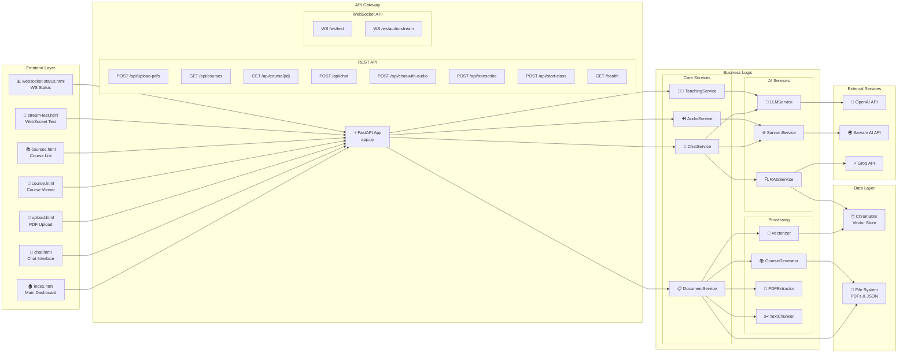

## 1. Overall System Architecture

```mermaid
graph LR
    subgraph "Frontend Layer"
        direction TB
        UI1["🏠 index.html<br/>Main Dashboard"]
        UI2["💬 chat.html<br/>Chat Interface"]
        UI3["📄 upload.html<br/>PDF Upload"]
        UI4["📖 course.html<br/>Course Viewer"]
        UI5["📚 courses.html<br/>Course List"]
        UI6["🔧 stream-test.html<br/>WebSocket Test"]
        UI7["📊 websocket-status.html<br/>WS Status"]
    end
    
    subgraph "API Gateway"
        direction TB
        API["⚡ FastAPI App<br/>app.py"]
        
        subgraph "REST API"
            direction TB
            REST1["POST /api/upload-pdfs"]
            REST2["GET /api/courses"]
            REST3["GET /api/course/{id}"]
            REST4["POST /api/chat"]
            REST5["POST /api/chat-with-audio"]
            REST6["POST /api/transcribe"]
            REST7["POST /api/start-class"]
            REST8["GET /health"]
        end
        
        subgraph "WebSocket API"
            direction TB
            WS1["WS /ws/test"]
            WS2["WS /ws/audio-stream"]
        end
    end
    
    subgraph "Business Logic"
        direction TB
        
        subgraph "Core Services"
            direction TB
            CHAT["💭 ChatService"]
            DOC["📋 DocumentService"]
            AUDIO["🔊 AudioService"]
            TEACH["👨‍🏫 TeachingService"]
        end
        
        subgraph "AI Services"
            direction TB
            LLM["🤖 LLMService"]
            RAG["🔍 RAGService"]
            SARVAM["🌐 SarvamService"]
        end
        
        subgraph "Processing"
            direction TB
            COURSE["📚 CourseGenerator"]
            VECTOR["🧮 Vectorizer"]
            PDF["📄 PDFExtractor"]
            CHUNK["✂️ TextChunker"]
        end
    end
    
    subgraph "External Services"
        direction TB
        OPENAI["🧠 OpenAI API"]
        SARVAM_API["🌍 Sarvam AI API"]
        GROQ["⚡ Groq API"]
    end
    
    subgraph "Data Layer"
        direction TB
        CHROMA["🗄️ ChromaDB<br/>Vector Store"]
        FILES["💾 File System<br/>PDFs & JSON"]
    end
    
    %% Main flow connections
    UI1 --> API
    UI2 --> API
    UI3 --> API
    UI4 --> API
    UI5 --> API
    UI6 --> API
    UI7 --> API
    
    API --> CHAT
    API --> DOC
    API --> AUDIO
    API --> TEACH
    
    CHAT --> LLM
    CHAT --> RAG
    CHAT --> SARVAM
    
    DOC --> COURSE
    DOC --> VECTOR
    DOC --> PDF
    DOC --> CHUNK
    
    AUDIO --> SARVAM
    TEACH --> LLM
    
    LLM --> OPENAI
    RAG --> GROQ
    SARVAM --> SARVAM_API
    
    VECTOR --> CHROMA
    RAG --> CHROMA
    DOC --> FILES
    COURSE --> FILES
```
